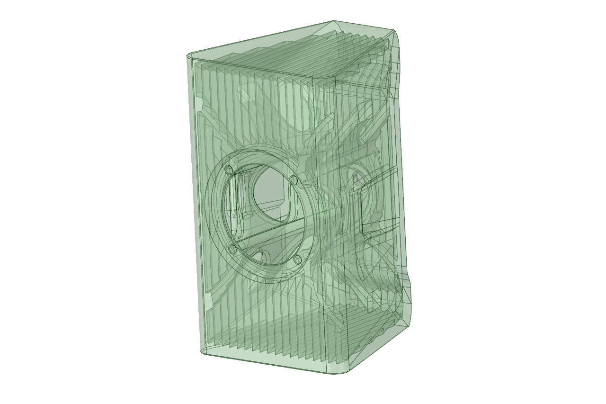

# Desktop Speaker
This is a desktop speaker designed for use with PCs.
It is an extremely small and simple speaker with only a 5cm full-range driver, but it produces a high-quality sound.

 
 
 
 

## Parts Printing
- Layer height 0.3mm, Extrusion width 0.6mm, Wall count 3, Top/Bottom layers 4, Infill 75%.
- Do not require support.
- To reduce unwanted resonance, please use matte PLA, PC-CF, or similar filaments.
- Printing a left-right pair will require approximately 1kg of filament.

## BOM
- Scan-Speak 5F/8422T01 Full-range driver x2
- RCA socket x2
- M3 Insert Nut x8
- M3 x 8mm Bolt x8
- Sound-absorbing felt
- Wiring cable

